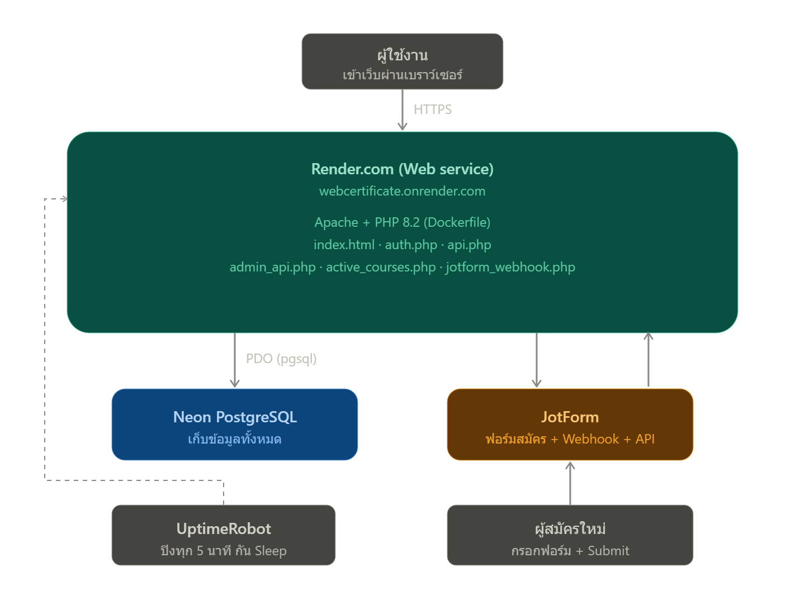

# ระบบออกใบประกาศนียบัตร — ศูนย์อบรมคอมพิวเตอร์ วัดพระธรรมกาย

ระบบออกใบประกาศนียบัตรให้ผู้เข้าอบรม พร้อมระบบจัดการหลักสูตร/รายชื่อผู้เรียน และรับสมัครผ่านฟอร์มออนไลน์แบบอัตโนมัติ

**เว็บไซต์ใช้งานจริง:** https://webcertificate.onrender.com

---

## สารบัญ
1. [ภาพรวมระบบทำอะไรได้บ้าง](#ภาพรวมระบบทำอะไรได้บ้าง)
2. [สถาปัตยกรรมระบบ (System Architecture)](#สถาปัตยกรรมระบบ-system-architecture)
3. [เทคโนโลยีที่ใช้](#เทคโนโลยีที่ใช้)
4. [โครงสร้างไฟล์ + คำอธิบายทีละไฟล์](#โครงสร้างไฟล์--คำอธิบายทีละไฟล์)
5. [โครงสร้างฐานข้อมูล](#โครงสร้างฐานข้อมูล)
6. [Data Flow แต่ละสถานการณ์](#data-flow-แต่ละสถานการณ์)
7. [การตั้งค่าที่สำคัญ](#การตั้งค่าที่สำคัญ)
8. [ข้อจำกัดและวิธีแก้ที่ใช้อยู่](#ข้อจำกัดและวิธีแก้ที่ใช้อยู่)
9. [ปัญหาที่เคยเจอ และวิธีแก้ (Troubleshooting Log)](#ปัญหาที่เคยเจอ-และวิธีแก้-troubleshooting-log)
10. [ความปลอดภัย — สิ่งที่ควรทำต่อ](#ความปลอดภัย--สิ่งที่ควรทำต่อ)
11. [ประวัติการพัฒนา](#ประวัติการพัฒนา)

---

## ภาพรวมระบบทำอะไรได้บ้าง

ระบบนี้มี 3 กลุ่มผู้ใช้งาน:

### 1. ผู้เข้าอบรม (หน้าแรกของเว็บ — Public)
เลือก **ปีที่อบรม → หลักสูตร → ชื่อตัวเอง** แล้วกดดาวน์โหลดใบประกาศนียบัตรเป็นไฟล์ภาพ (PNG) ได้ทันที ระบบจะดึงชื่อ-นามสกุลมาใส่ในใบประกาศให้อัตโนมัติ พร้อม QR Code สำหรับตรวจสอบความถูกต้อง (ถ้าหลักสูตรนั้นตั้งค่า verify URL ไว้)

### 2. เจ้าหน้าที่ (Admin Panel — ต้อง Login)
- **จัดการหลักสูตร** — เพิ่ม/แก้ไข/ลบหลักสูตร, วันที่อบรม, ปี พ.ศ., ลิงก์ QR verify
- **จัดการรายชื่อผู้เรียน** — ดู/ค้นหา/แก้ไข/ลบ พร้อมแบ่งหน้าและเรียงลำดับ
- **เปิด/ปิดรับสมัคร** — เลือกหลักสูตรที่เปิดให้สมัครผ่านฟอร์มออนไลน์ แล้วกด "Sync to JotForm" เพื่ออัปเดต dropdown ของฟอร์มให้ตรงกับหลักสูตรที่เปิดอยู่จริง

### 3. ผู้สมัครเรียนใหม่ (ภายนอกบริษัท ผ่าน JotForm)
กรอกฟอร์มสมัครใน JotForm เลือกหลักสูตรจาก dropdown (sync มาจากระบบ admin) กด Submit แล้วข้อมูลเข้าฐานข้อมูลทันทีโดยไม่ต้องมีคนกรอกซ้ำ

---

## สถาปัตยกรรมระบบ (System Architecture)

จุดสำคัญของสถาปัตยกรรมนี้คือ **แยกตามทิศทางการเชื่อมต่อ**: ส่วนไหนต้อง "รับ" การเชื่อมต่อจากภายนอกอินเทอร์เน็ต (ต้องมี public URL) กับส่วนไหนแค่ "เชื่อมต่อออกไปหา" บริการอื่น (รันจากที่ไหนก็ได้)



### ทำไมต้องออกแบบแบบนี้ (เหตุผลเชิงสถาปัตยกรรม)

| คำถาม | คำตอบ |
|---|---|
| ทำไมต้องมี public hosting (Render) ทั้งที่คนใช้จริงอยู่แค่ในบริษัท? | เพราะ **JotForm ต้องยิง Webhook เข้ามาหา `jotform_webhook.php` ได้** — นี่คือ "ขาเข้า" (inbound) จากอินเทอร์เน็ตภายนอก server ที่อยู่หลัง firewall บริษัท (intranet-only) จะไม่มีทางถูกเรียกถึงได้เลย |
| ทำไม PHP เชื่อมกับ Neon ได้จากทุกที่ (ทั้ง localhost และ Render)? | เพราะการเชื่อมต่อไปหา Neon เป็น **"ขาออก" (outbound)** — server เราเป็นฝ่ายโทรออกไปหา Neon เอง ไม่ว่าจะรันจากที่ไหนก็ทำได้ตราบใดที่มี internet และ credential ถูกต้อง |
| ทำไมไม่ใช้ Google Apps Script เหมือนเดิม? | ระบบเดิมใช้ Apps Script เป็น "ตัวกลางที่มี public URL ฟรีจาก Google" คอยรับ Webhook แทน แล้วค่อยต่อไปหา Supabase อีกที ปัจจุบันตัดตัวกลางนี้ออก ให้ PHP ของเรารับ Webhook เองตรง ๆ ลดจุดเชื่อมต่อที่ต้องดูแล |

---

## เทคโนโลยีที่ใช้

| ส่วน | เทคโนโลยี | หน้าที่ |
|---|---|---|
| **Frontend** | HTML + CSS + Vanilla JavaScript (ไฟล์เดียว `index.html`) | หน้าดาวน์โหลดใบประกาศ + หน้า Admin Panel |
| **สร้างภาพใบประกาศ** | [html2canvas](https://html2canvas.hertzen.com/) | แปลง HTML เป็นไฟล์ภาพ PNG ให้ดาวน์โหลด |
| **QR Code** | [qrcodejs](https://github.com/davidshimjs/qrcodejs) | สร้าง QR Code บนใบประกาศ |
| **Backend** | PHP 8.2 (ไม่ใช้ framework, ใช้ PDO ตรง ๆ) | ประมวลผล API ทั้งหมด |
| **Database** | [Neon](https://neon.tech) — PostgreSQL แบบ Serverless | เก็บข้อมูลหลักสูตรและผู้เรียนทั้งหมด |
| **Hosting** | [Render](https://render.com) — Web Service แบบ Docker (แผนฟรี) | รันเว็บ PHP ให้มี public URL |
| **Container** | Docker (`php:8.2-apache` + extension `pdo_pgsql`) | กำหนด environment ให้ Render รันได้ตรงตามที่ต้องการ |
| **รับสมัครออนไลน์** | [JotForm](https://www.jotform.com) | ฟอร์มให้คนภายนอกกรอกสมัครเรียน + JotForm API สำหรับแก้ไข dropdown |
| **Keep-alive** | [UptimeRobot](https://uptimerobot.com) | ปิงเว็บทุก 5 นาที ป้องกัน Render sleep หลัง idle 15 นาที |

---

## โครงสร้างไฟล์ + คำอธิบายทีละไฟล์

```
webcertificate/
├── Dockerfile
├── index.html
├── logo.png, main1.png, line-qr.png
├── .gitignore
│
├── backend/
│   ├── auth.php
│   ├── api.php
│   ├── admin_api.php
│   ├── active_courses.php
│   └── jotform_webhook.php
│
└── database/
    ├── schema.sql
    └── config.php
```

### `Dockerfile`
ตั้งค่า container ที่ Render ใช้รันเว็บ:
- ใช้ image ตั้งต้น `php:8.2-apache`
- ติดตั้ง `pdo_pgsql` extension (จำเป็นมากสำหรับต่อ Neon/Postgres — ถ้าไม่มีตัวนี้เชื่อมต่อ database ไม่ได้เลย)
- คัดลอกโค้ดทั้งโปรเจกต์เข้า `/var/www/html/`
- ตั้งให้ Apache ฟัง port ที่ Render กำหนดผ่าน environment variable `PORT` (Render ไม่ใช้ port 80 ตายตัวเหมือน server ทั่วไป)

### `index.html`
ไฟล์เดียวที่รวมทั้งหน้า UI ทั้งหมด แบ่งเป็น 2 ส่วนหลักที่สลับกันด้วยแท็บ (`switchTab()`):
- **`#view-download`** — หน้าดาวน์โหลดใบประกาศ (public) มี dropdown เลือกปี/หลักสูตร/ชื่อ, พรีวิวใบประกาศแบบ real-time, สไลเดอร์ปรับตำแหน่งข้อความ, ปุ่มดาวน์โหลด PNG ผ่าน html2canvas
- **`#admin-data-view`** — หน้า Admin (ต้อง login ก่อนถึงจะเห็นแท็บนี้) แบ่งเป็น 3 เมนูย่อย: คอร์สทั้งหมด / รายชื่อผู้เรียน / เปิดรับสมัคร

โครงสร้าง JavaScript ภายในแบ่งเป็น 3 `<script>` blocks: (1) ตรรกะหน้าดาวน์โหลด, (2) ระบบ login/logout, (3) ตรรกะ admin panel ทั้งหมด (ตาราง, modal แก้ไข, sync)

### `backend/auth.php`
ระบบ login ของ admin แบบง่าย ใช้ PHP session (`$_SESSION['is_admin']`)
- `action=login` — เช็ค username/password ตรงกับค่าคงที่ `ADMIN_USER` / `ADMIN_PASS` ที่ฝังในไฟล์ (มี delay 1 วินาทีตอน login ผิดเพื่อกัน brute-force แบบเบื้องต้น)
- `action=logout` — ทำลาย session
- `action=check` — เช็คว่า session ปัจจุบัน login อยู่ไหม (เรียกทุกครั้งที่โหลดหน้าเว็บ เพื่อโชว์/ซ่อนแท็บ admin)

⚠️ **ไม่ต้อง login ก็เรียกไฟล์นี้ได้** (เป็นปกติ เพราะเป็นทางเข้าสู่ระบบ) แต่ทุก endpoint อื่นที่เป็นของ admin (`admin_api.php`, `active_courses.php`) จะเช็ค `$_SESSION['is_admin']` ก่อนเสมอ

### `backend/api.php`
Endpoint สาธารณะ (ไม่ต้อง login) ที่หน้าดาวน์โหลดใบประกาศเรียกใช้ตอนโหลดหน้าเว็บ — ดึงรายชื่อผู้เรียน**ทั้งหมด**พร้อมข้อมูลคอร์สที่ join กันไว้แล้ว จัดรูปแบบ JSON ให้มีโครงสร้างคล้าย Airtable เดิม (คีย์ `fields` เป็นชื่อคอลัมน์ภาษาไทย) เพื่อให้โค้ด JavaScript ฝั่ง frontend ไม่ต้องแก้อะไรตอนย้ายฐานข้อมูล

### `backend/admin_api.php`
Endpoint หลักสำหรับ CRUD ทั้งหมดในหน้า Admin (ต้อง login) รวม action ต่อไปนี้:
| Action | หน้าที่ |
|---|---|
| `list_courses` | ดึงคอร์สทั้งหมด พร้อมนับจำนวนผู้เรียนต่อคอร์ส |
| `add_course` / `update_course` / `delete_course` | จัดการหลักสูตร |
| `list_students` | ดึงรายชื่อผู้เรียนแบบแบ่งหน้า รองรับค้นหา/กรองปี/กรองคอร์ส/เรียงลำดับ (มี whitelist คอลัมน์ป้องกัน SQL Injection ผ่าน `ORDER BY`) |
| `get_student` | ดึงข้อมูลผู้เรียน 1 คนแบบละเอียด (ใช้ตอนเปิด modal แก้ไข) |
| `add_student` / `update_student` / `delete_student` | จัดการรายชื่อผู้เรียน |

### `backend/active_courses.php`
Endpoint สำหรับหน้า "เปิดรับสมัคร" (ต้อง login) มี 3 actions:
| Action | หน้าที่ |
|---|---|
| `list` | ดึงคอร์สทั้งหมด พร้อม flag `is_active` ว่าเปิดรับสมัครอยู่ไหม |
| `toggle` | เปิด/ปิดคอร์ส (insert/delete ในตาราง `active_courses`) |
| `sync_jotform` | ดึงคอร์สที่เปิดอยู่ทั้งหมดจาก Neon → เรียก **JotForm API โดยตรง** เพื่ออัปเดตตัวเลือกใน dropdown field ของฟอร์มสมัคร (แทนที่การพึ่ง Google Apps Script แบบเดิม) |

### `backend/jotform_webhook.php`
**Endpoint สำคัญที่สุดตัวหนึ่ง** — เป็นจุดเดียวในระบบที่ **ต้องเปิดรับ request จากภายนอกอินเทอร์เน็ตจริง ๆ** (ไม่ต้อง login เพราะ JotForm server เป็นคนเรียก ไม่ใช่คนในบริษัท)

ทำงานดังนี้:
1. รับข้อมูลดิบจาก JotForm ผ่าน field `rawRequest` (เป็น JSON string ที่ต้อง decode อีกที)
2. แกะฟิลด์ต่าง ๆ ตาม field ID ของฟอร์ม (เช่น `q110_typeA110` = ชื่อ, `q93_input115` = คอร์สที่เลือก)
3. ค้นหา `course_id` จากชื่อคอร์ส (ต้อง match เป๊ะกับ `short_name` ในตาราง `courses`)
4. ถ้าหาคอร์สไม่เจอ → ตอบ error ทันที (ป้องกัน insert พังเพราะ `course_id` เป็น `NOT NULL`)
5. Insert ข้อมูลลงตาราง `students` ผ่าน `RETURNING id` (วิธีที่ถูกต้องสำหรับ Postgres แทนการใช้ `lastInsertId()` แบบ MySQL)
6. Log ผลลัพธ์ผ่าน `error_log()` เพื่อให้เห็นใน Render Logs (ไม่ใช้การเขียนไฟล์ log เพราะ Render อาจไม่ให้สิทธิ์เขียนไฟล์ในโฟลเดอร์นี้)

### `database/schema.sql`
คำสั่ง SQL สำหรับสร้างฐานข้อมูลและตารางทั้งหมด — **หมายเหตุ: ไฟล์นี้เขียนด้วย syntax ของ MySQL (`AUTO_INCREMENT`, `ENGINE=InnoDB` ฯลฯ) ซึ่งเป็นของระบบเดิมก่อนย้ายมา Neon (Postgres)** ปัจจุบันตารางจริงใน Neon ถูกสร้าง/ย้ายข้อมูลมาด้วยวิธีอื่นแล้ว ไฟล์นี้จึงเหลือไว้เป็นข้อมูลอ้างอิงโครงสร้างเท่านั้น ไม่ควรรันตรง ๆ กับ Neon (ต้องแปลงเป็น syntax ของ Postgres ก่อน เช่น `SERIAL` แทน `AUTO_INCREMENT`, `COMMENT` ต้องย้ายไปใช้ `COMMENT ON COLUMN` แยกคำสั่ง)

### `database/config.php`
เก็บค่าการเชื่อมต่อ Neon (host, port, database name, username, password) และฟังก์ชัน `getDB()` ที่คืนค่า PDO connection แบบ singleton (เชื่อมครั้งเดียวต่อ request แล้ว reuse) ทุกไฟล์ backend เรียก `require_once` ไฟล์นี้เพื่อขอ connection

⚠️ ไฟล์นี้มี password ฝังอยู่ตรง ๆ — ดูหัวข้อ [ความปลอดภัย](#ความปลอดภัย--สิ่งที่ควรทำต่อ) ด้านล่าง

### `.gitignore`
ปัจจุบัน**ไม่ได้กัน `database/config.php` ออกจาก Git แล้ว** (ถูกลบบรรทัดนี้ออกไปตอน deploy ขึ้น Render เพื่อให้ credential ติดไปกับ repo ด้วย เนื่องจาก Render ต้อง build จากโค้ดใน GitHub) — เพราะงั้น **repo ต้องเป็น Private เท่านั้นห้ามเปิด Public เด็ดขาด**

---

## โครงสร้างฐานข้อมูล

### ตาราง `courses`
| คอลัมน์ | ความหมาย |
|---|---|
| `id` | primary key |
| `long_key` | ชื่อยาว (ใช้ตอนย้ายข้อมูลจาก Airtable เดิม) |
| `short_name` | ชื่อย่อ — **ใช้ match กับ dropdown ใน JotForm ต้องตรงเป๊ะ** |
| `training_date` | วันที่อบรม (ข้อความอิสระ เช่น "วันที่ 5-7 พ.ค. 2569") |
| `year_be` | ปี พ.ศ. ใช้กรอง |
| `verify_url` | ลิงก์ปลายทางของ QR Code บนใบประกาศ |

### ตาราง `students`
เก็บข้อมูลผู้เรียนแต่ละคน ผูกกับหลักสูตรผ่าน `course_id` (Foreign Key, `NOT NULL`) มีฟิลด์ข้อมูลส่วนตัวครบถ้วน (ชื่อ, เบอร์, อีเมล, หน่วยงาน, ตำแหน่ง ฯลฯ)

### ตาราง `active_courses`
ตารางเชื่อม (junction table) เก็บแค่ `course_id` ที่กำลังเปิดรับสมัครอยู่ — ถ้ามีแถวในนี้แปลว่าคอร์สนั้นเปิดรับสมัคร ถ้าไม่มีแปลว่าปิด

---

## Data Flow แต่ละสถานการณ์

### 1. ผู้เข้าอบรมดาวน์โหลดใบประกาศ
```
เปิดเว็บ → api.php (ดึงรายชื่อทั้งหมด) → เลือกปี/คอร์ส/ชื่อ (กรองฝั่ง frontend)
        → พรีวิวใบประกาศ real-time → กด "ดาวน์โหลด" → html2canvas แปลงเป็น PNG
```
ทั้งหมดนี้ทำงานฝั่ง browser ล้วน ๆ หลังจากโหลดข้อมูลมาครั้งแรก ไม่มีการยิง request เพิ่มตอนดาวน์โหลด

### 2. ผู้สมัครใหม่กรอกฟอร์ม JotForm
```
[ผู้สมัคร] กรอกฟอร์ม + เลือกหลักสูตร → กด Submit
        → JotForm ยิง Webhook (HTTP POST พร้อม field 'rawRequest')
        → backend/jotform_webhook.php
        → decode rawRequest, แกะฟิลด์
        → ค้นหา course_id จาก short_name
        → INSERT INTO students ... RETURNING id
        → ตอบกลับ {ok:true, id:...} ให้ JotForm
```

### 3. Admin เปิด/ปิดคอร์สแล้ว Sync ไปยัง JotForm
```
[Admin] ติ๊กเปิด/ปิดคอร์ส → active_courses.php?action=toggle (insert/delete active_courses)
[Admin] กด "Sync to JotForm" → active_courses.php?action=sync_jotform
        → SELECT short_name จาก active_courses join courses
        → รวมชื่อคอร์สด้วย '|' → เรียก JotForm API (POST /form/{id}/question/{field})
        → JotForm อัปเดตตัวเลือกใน dropdown ของฟอร์มจริง
```

---

## การตั้งค่าที่สำคัญ

| ค่า | อยู่ที่ไฟล์ | หมายเหตุ |
|---|---|---|
| Neon database credentials | `database/config.php` | host / port / dbname / user / password |
| JotForm API Key | `backend/active_courses.php` | `JOTFORM_API_KEY` |
| JotForm Form ID | `backend/active_courses.php` | `JOTFORM_FORM_ID` = `261701468554460` |
| JotForm Field ID (dropdown คอร์ส) | `backend/active_courses.php` | `JOTFORM_FIELD_ID` = `93` |
| Admin username/password | `backend/auth.php` | `ADMIN_USER` / `ADMIN_PASS` |
| Webhook ปลายทางใน JotForm | ตั้งที่ JotForm → Settings → Integrations → Webhooks | ต้องชี้ไปที่ `https://webcertificate.onrender.com/backend/jotform_webhook.php` |

---

## ข้อจำกัดและวิธีแก้ที่ใช้อยู่

### Render แผนฟรี "หลับ" หลัง idle 15 นาที
- เมื่อไม่มีคนเข้าใช้ 15 นาที Render จะปิด container ชั่วคราว คนแรกที่กลับมาเข้าเว็บต้องรอ ~30-50 วินาทีให้ container ตื่น
- **วิธีแก้ที่ใช้อยู่ตอนนี้:** ตั้ง **UptimeRobot** ให้ปิง `https://webcertificate.onrender.com/` ทุก 5 นาที ทำให้เว็บไม่เคย idle ครบ 15 นาที จึงไม่เคยหลับ
- ถ้าต้องการความเสถียรแบบไม่ต้องพึ่งวิธีนี้ ทางเลือกคืออัปเกรด Render เป็นแผนเสียเงิน (Starter ~$7/เดือน) ซึ่งไม่มีการ sleep เลย

### Admin session หลุดบ่อย
เกิดจากเหตุผลเดียวกับข้างบน — ทุกครั้งที่ container restart (ก่อนมี UptimeRobot) ไฟล์ session จะหายไปด้วย ตอนนี้ที่ไม่ค่อย sleep แล้วปัญหานี้ควรเกิดน้อยลงมาก

---

## ปัญหาที่เคยเจอ และวิธีแก้ (Troubleshooting Log)

บันทึกไว้เผื่อเจอปัญหาเดิมซ้ำในอนาคต:

| ปัญหา | สาเหตุ | วิธีแก้ |
|---|---|---|
| `Unexpected token '<', "..." is not valid JSON` ตอนเปิดเว็บครั้งแรกบน Render | `.gitignore` กัน `database/config.php` ไว้ ทำให้ไฟล์ config ไม่ถูก push ขึ้น GitHub → `require_once` หาไฟล์ไม่เจอ → PHP โยน Fatal Error เป็นหน้า HTML แทน JSON | ลบบรรทัด `database/config.php` ออกจาก `.gitignore` แล้ว commit+push ไฟล์ config เข้าไปด้วย (ต้องเป็น Private repo) |
| `❌ Unauthorized` หลัง deploy โค้ดใหม่ทั้งที่เพิ่ง login | Container restart ตอน deploy ทำให้ PHP session (เก็บเป็นไฟล์ใน container) หายไปหมด | Login ใหม่อีกครั้ง |
| `POST /backend/jotform_webhook.php` ได้ 500 ทุกครั้งที่ JotForm ยิงมาจริง | `SQLSTATE[23505]: Unique violation ... duplicate key value violates unique constraint "students_pkey"` — ตอนย้ายข้อมูลจาก Supabase มา Neon โดย insert พร้อม id เดิม แต่ไม่ได้อัปเดต sequence (auto-increment counter) ให้ตรงกับข้อมูลจริง | รัน SQL รีเซ็ต sequence ให้ตรงกับ `MAX(id)` ปัจจุบันของตาราง (`SELECT setval(pg_get_serial_sequence('students','id'), (SELECT MAX(id) FROM students))`) ทำครั้งเดียวจบ ควรทำแบบเดียวกันกับตาราง `courses` ด้วย |
| เขียน log ไฟล์ (`jotform_webhook.log`) ไม่ได้ ขึ้น 404 ตลอด | โฟลเดอร์ `backend/` บน Render (ที่ build จาก Docker image) ไม่มีสิทธิ์เขียนไฟล์ใหม่ให้ PHP process | เปลี่ยนมาใช้ `error_log()` แทนการเขียนไฟล์ — log จะไปโผล่ที่ Render → Logs โดยตรง ไม่ต้องพึ่ง filesystem เขียนได้ |
| เว็บดับ/โหลดช้ามากเป็นระยะ | พฤติกรรมปกติของ Render แผนฟรี (spin down เมื่อ idle เกิน 15 นาที) | ตั้ง UptimeRobot ปิงทุก 5 นาที (ดูหัวข้อข้อจำกัดด้านบน) |

---

## ความปลอดภัย — สิ่งที่ควรทำต่อ

ระบบนี้ทำให้ "ใช้งานได้" เป็นเป้าหมายหลักในการพัฒนารอบนี้ แต่ยังมีจุดที่ควรปรับปรุงเพื่อความปลอดภัยในระยะยาว:

- [ ] **Neon database password ฝังอยู่ตรง ๆ ใน `database/config.php`** ซึ่ง commit เข้า Git แล้ว — ต้องมั่นใจว่า repo เป็น **Private ตลอดเวลา** ไม่มีวันเปิด Public เด็ดขาด แนะนำให้ย้ายไปใช้ **Environment Variables** ผ่านหน้า Render Dashboard แทนการฝังในโค้ดในอนาคต
- [ ] **JotForm API Key ฝังอยู่ตรง ๆ ใน `active_courses.php`** — ควรย้ายไป Environment Variable เช่นกัน
- [ ] **Admin password เป็น `123`** ในไฟล์ `auth.php` — ควรเปลี่ยนเป็นรหัสผ่านที่คาดเดายากกว่านี้ก่อนใช้งานจริงจัง และพิจารณาเก็บเป็น hash แทน plaintext
- [ ] **`jotform_webhook.php` ไม่มีการยืนยันตัวตนใด ๆ เลย** (ใครก็ยิง POST มาปลอมข้อมูลเข้าระบบได้ถ้ารู้ URL) — ควรเพิ่ม secret token ตรวจสอบใน request หรือเช็ค IP ของ JotForm ในอนาคต

---

## ประวัติการพัฒนา

ระบบเดิมใช้ **Supabase (PostgreSQL)** ร่วมกับ **Google Apps Script** เป็นตัวกลางเชื่อมระหว่าง JotForm กับฐานข้อมูล ปัจจุบันได้ย้ายฐานข้อมูลทั้งหมดมาที่ **Neon** และตัดการพึ่งพา Google Apps Script ออก โดยให้ JotForm ยิง Webhook มาที่ PHP backend ของระบบเองโดยตรง ทำให้โครงสร้างเรียบง่ายขึ้น มีจุดเชื่อมต่อน้อยลง และดูแลรักษาง่ายกว่าเดิม ส่วนปัญหาเว็บ "หลับ" ของ hosting แผนฟรีก็แก้ด้วย UptimeRobot ทำให้ใช้งานได้ต่อเนื่องโดยไม่ต้องเสียค่าใช้จ่ายเพิ่ม