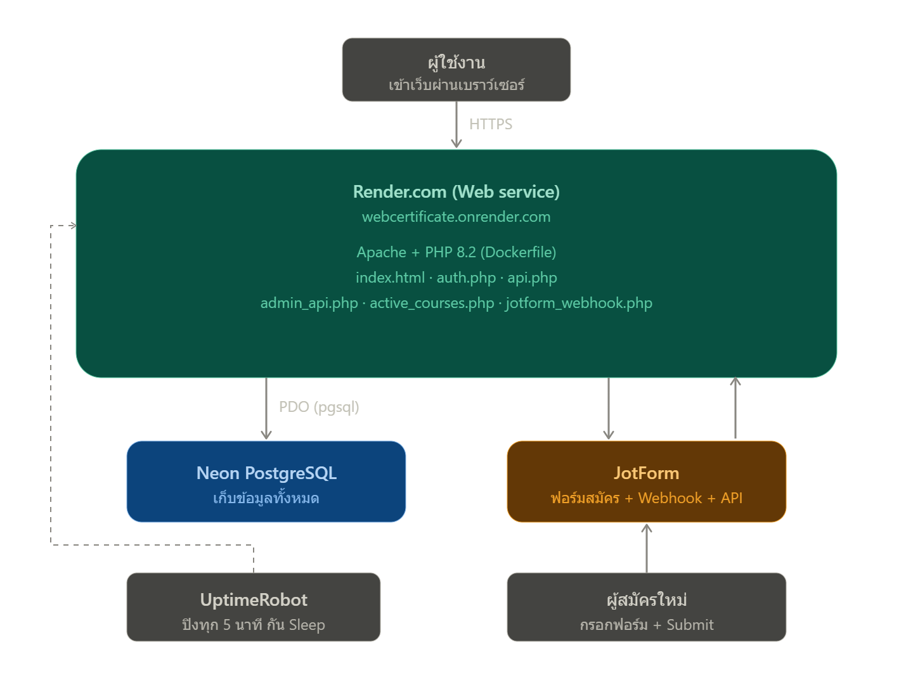

# ระบบออกใบประกาศนียบัตร — ศูนย์อบรมคอมพิวเตอร์ วัดพระธรรมกาย

ระบบออกใบประกาศนียบัตรให้ผู้เข้าอบรม พร้อมระบบจัดการหลักสูตร/รายชื่อผู้เรียน และรับสมัครผ่านฟอร์มออนไลน์แบบอัตโนมัติ

**เว็บไซต์ใช้งานจริง:** https://comtrain-webcertificate.onrender.com/

---

## สารบัญ
1. [ภาพรวมระบบทำอะไรได้บ้าง](#ภาพรวมระบบทำอะไรได้บ้าง)
2. [สถาปัตยกรรมระบบ (System Architecture)](#สถาปัตยกรรมระบบ-system-architecture)
3. [เทคโนโลยีที่ใช้](#เทคโนโลยีที่ใช้)
4. [โครงสร้างไฟล์ + คำอธิบายทีละไฟล์](#โครงสร้างไฟล์--คำอธิบายทีละไฟล์)
5. [โครงสร้างฐานข้อมูล](#โครงสร้างฐานข้อมูล)
6. [Data Flow แต่ละสถานการณ์](#data-flow-แต่ละสถานการณ์)
7. [วิธีรันโปรเจกต์บนเครื่องตัวเอง (Local Setup)](#วิธีรันโปรเจกต์บนเครื่องตัวเอง-local-setup)
8. [Environment Variables ที่ต้องตั้งค่า](#environment-variables-ที่ต้องตั้งค่า)
9. [ข้อจำกัดและวิธีแก้ที่ใช้อยู่](#ข้อจำกัดและวิธีแก้ที่ใช้อยู่)
10. [ปัญหาที่เคยเจอ และวิธีแก้ (Troubleshooting Log)](#ปัญหาที่เคยเจอ-และวิธีแก้-troubleshooting-log)
11. [ประวัติการพัฒนา](#ประวัติการพัฒนา)

---

## ภาพรวมระบบทำอะไรได้บ้าง

ระบบนี้มี 3 กลุ่มผู้ใช้งาน:

### 1. ผู้เข้าอบรม (หน้าแรกของเว็บ — Public)
เลือก **ปีที่อบรม → หลักสูตร → ชื่อตัวเอง** แล้วกดดาวน์โหลดใบประกาศนียบัตรเป็นไฟล์ภาพ (PNG) ได้ทันที ระบบจะดึงชื่อ-นามสกุลมาใส่ในใบประกาศให้อัตโนมัติ พร้อม QR Code สำหรับตรวจสอบความถูกต้อง (ถ้าหลักสูตรนั้นตั้งค่า verify URL ไว้)

### 2. เจ้าหน้าที่ (Admin Panel — ต้อง Login)
- **จัดการหลักสูตร** — เพิ่ม/แก้ไข/ลบหลักสูตร, วันที่อบรม, ปี พ.ศ., ลิงก์ QR verify
- **จัดการรายชื่อผู้เรียน** — ดู/ค้นหา/แก้ไข/ลบ พร้อมแบ่งหน้าและเรียงลำดับ
- **เปิด/ปิดรับสมัคร** — เลือกหลักสูตรที่เปิดให้สมัครผ่านฟอร์มออนไลน์ แล้วกด "Sync to JotForm" เพื่ออัปเดต dropdown ของฟอร์มให้ตรงกับหลักสูตรที่เปิดอยู่จริง
- **นำเข้าข้อมูลจาก Airtable** — ดึงรายชื่อคอร์สและผู้สมัครจาก Airtable เดิม เปรียบเทียบกับคอร์สในระบบ แบ่งเป็น "คอร์สใหม่" และ "คอร์สที่มีอยู่แล้ว" แล้วเลือกนำเข้าเป็นรายคอร์ส

### 3. ผู้สมัครเรียนใหม่ (ภายนอกบริษัท ผ่าน JotForm)
กรอกฟอร์มสมัครใน JotForm เลือกหลักสูตรจาก dropdown (sync มาจากระบบ admin) กด Submit แล้วข้อมูลเข้าฐานข้อมูลทันทีโดยไม่ต้องมีคนกรอกซ้ำ

---

## สถาปัตยกรรมระบบ (System Architecture)



### สถาปัตยกรรมภายในฝั่ง Backend

โค้ดฝั่ง PHP แบ่งเป็น 3 ชั้นตามหลัก separation of concerns:

```
ไฟล์ endpoint (admin_api.php, api.php, active_courses.php, jotform_webhook.php)
        │  รับ HTTP request, validate input เบื้องต้น, ตอบ JSON กลับ
        ▼
Repository layer (backend/lib/CourseRepository.php, StudentRepository.php)
        │  รวม SQL ทั้งหมดไว้ที่เดียว ไม่ปนกับ HTTP handling
        ▼
Database (Neon PostgreSQL)
```

พร้อมด้วยไฟล์ shared ที่ endpoint ทุกตัวเรียกใช้ร่วมกัน:
- **`backend/lib/load_env.php`** — โหลดไฟล์ `.env` เข้า environment อัตโนมัติตอนรันบนเครื่อง local (บน Render ข้ามไปเลย เพราะไม่มีไฟล์ `.env`)
- **`backend/lib/require_admin.php`** — middleware เช็คสิทธิ์ admin กลาง ใช้ที่เดียวไม่ต้องเขียนซ้ำทุกไฟล์
- **`backend/lib/error_handler.php`** — จัดการ error กลาง log รายละเอียดจริงไว้ฝั่ง server เท่านั้น ส่งข้อความทั่วไปกลับไปหา client (ไม่เผยรายละเอียด database ให้ผู้ไม่หวังดี)

### สถาปัตยกรรมภายในฝั่ง Frontend

`index.html` เหลือแค่ markup ล้วน ๆ ไม่มี CSS/JavaScript ฝังอยู่ในไฟล์แล้ว โดยแยกออกเป็น:

```
index.html (markup เท่านั้น)
   ├── assets/css/style.css        สไตล์ทั้งหมดของเว็บ
   └── assets/js/
         ├── certificate.js        หน้าดาวน์โหลดใบประกาศ (โหลดข้อมูล, dropdown, พรีวิว, ดาวน์โหลด PNG)
         ├── auth.js               ระบบ login/logout admin
         └── admin.js              ตรรกะหน้า Admin Panel ทั้งหมด (ตารางคอร์ส, ตารางผู้เรียน, เปิดรับสมัคร, นำเข้า Airtable)
```

---

## เทคโนโลยีที่ใช้

| ส่วน | เทคโนโลยี | หน้าที่ |
|---|---|---|
| **Frontend** | HTML + CSS + Vanilla JavaScript (แยกไฟล์ตาม responsibility) | หน้าดาวน์โหลดใบประกาศ + หน้า Admin Panel |
| **สร้างภาพใบประกาศ** | [html2canvas](https://html2canvas.hertzen.com/) | แปลง HTML เป็นไฟล์ภาพ PNG ให้ดาวน์โหลด |
| **QR Code** | [qrcodejs](https://github.com/davidshimjs/qrcodejs) | สร้าง QR Code บนใบประกาศ |
| **Backend** | PHP 8.2 (ไม่ใช้ framework, ใช้ PDO ตรง ๆ) | ประมวลผล API ทั้งหมด แบ่งเป็น Controller + Repository layer |
| **Database** | [Neon](https://neon.tech) — PostgreSQL แบบ Serverless | เก็บข้อมูลหลักสูตรและผู้เรียนทั้งหมด |
| **Hosting** | [Render](https://render.com) — Web Service แบบ Docker (แผนฟรี) | รันเว็บ PHP ให้มี public URL |
| **Container** | Docker (`php:8.2-apache` + extension `pdo_pgsql`) | กำหนด environment ให้ Render รันได้ตรงตามที่ต้องการ |
| **รับสมัครออนไลน์** | [JotForm](https://www.jotform.com) | ฟอร์มให้คนภายนอกกรอกสมัครเรียน + JotForm API สำหรับแก้ไข dropdown |
| **นำเข้าข้อมูลเก่า** | [Airtable REST API](https://airtable.com/developers/web/api/introduction) | ดึงรายชื่อผู้สมัครและคอร์สจากระบบเดิม นำเข้าสู่ Neon ครั้งเดียว |
| **Keep-alive** | [UptimeRobot](https://uptimerobot.com) | ปิงเว็บทุก 5 นาที ป้องกัน Render sleep หลัง idle 15 นาที |

---

## โครงสร้างไฟล์ + คำอธิบายทีละไฟล์

```
webcertificate/
│   .env                    ← สร้างเองบนเครื่อง local (ห้าม commit ขึ้น GitHub)
│   .gitignore
│   Dockerfile
│   index.html
│   README.md
│
├───assets
│   ├───css
│   │       style.css
│   │
│   ├───docs
│   │       architecture-diagram.png
│   │
│   ├───images
│   │       line-qr.png
│   │       logo.png
│   │       main1.png
│   │
│   └───js
│           admin.js
│           auth.js
│           certificate.js
│
├───backend
│   │   active_courses.php
│   │   admin_api.php
│   │   api.php
│   │   auth.php
│   │   jotform_webhook.php
│   │
│   └───lib
│           AirtableClient.php
│           CourseRepository.php
│           error_handler.php
│           load_env.php
│           require_admin.php
│           StudentRepository.php
│
└───database
        config.php
        schema.sql
        seed.sql
```

### `Dockerfile`
ตั้งค่า container ที่ Render ใช้รันเว็บ: ใช้ image ตั้งต้น `php:8.2-apache`, ติดตั้ง `pdo_pgsql` extension (จำเป็นสำหรับต่อ Neon), คัดลอกโค้ดเข้า `/var/www/html/`, ตั้งให้ Apache ฟัง port ที่ Render กำหนดผ่าน environment variable `PORT`

### `.env` (ไม่ได้อยู่ใน Git)
ไฟล์เก็บ environment variables สำหรับรันบนเครื่อง local เท่านั้น ถูก ignore ไว้ใน `.gitignore` แล้ว ห้าม commit ขึ้น GitHub เด็ดขาด บน Render ตั้งค่าผ่าน Dashboard → Environment แทน

### `index.html`
Markup ล้วน ๆ ของหน้าเว็บทั้งหมด แบ่งเป็น 2 ส่วนหลักที่สลับกันด้วยแท็บ: หน้าดาวน์โหลดใบประกาศ (public) และหน้า Admin Panel (ต้อง login) ไม่มี CSS/JavaScript ฝังอยู่ในไฟล์นี้เลย

### `assets/css/style.css`
สไตล์ทั้งหมดของเว็บ (สี, layout, responsive, animation) แยกออกจาก `index.html` เพื่อให้แก้ไขและอ่านง่ายขึ้น

### `assets/js/certificate.js`
ตรรกะหน้าดาวน์โหลดใบประกาศ: โหลดรายชื่อจาก `api.php`, สร้าง dropdown เลือกปี/หลักสูตร/ชื่อ, อัปเดตพรีวิวใบประกาศแบบ real-time, สร้าง QR Code, และแปลงใบประกาศเป็นไฟล์ PNG ผ่าน html2canvas

### `assets/js/auth.js`
ระบบ login/logout admin ฝั่ง frontend: เปิด/ปิด modal login, เรียก `backend/auth.php`, เก็บสถานะ session ไว้ใน `sessionStorage`, และแสดง/ซ่อนแท็บ admin ตามสถานะ

### `assets/js/admin.js`
ตรรกะหน้า Admin Panel ทั้งหมด: สลับแท็บ, ตารางคอร์ส (ค้นหา/กรอง/เรียงลำดับ), ตารางรายชื่อผู้เรียน (ค้นหา/กรอง/เรียงลำดับ/แบ่งหน้า), modal เพิ่ม/แก้ไขข้อมูล, หน้าเปิดรับสมัคร + ปุ่ม Sync to JotForm และหน้านำเข้าข้อมูลจาก Airtable (แสดงผลแบบกลุ่มคอร์ส)

### `backend/lib/load_env.php`
โหลดไฟล์ `.env` เข้า environment อัตโนมัติตอนรันบนเครื่อง local — ทุก endpoint `require_once` ไฟล์นี้ไว้บนสุด บน Render ไม่มีไฟล์ `.env` ก็ข้ามไปเลยโดยไม่มีผลอะไร ออกแบบมาให้ใช้งานได้ทั้งสองสภาพแวดล้อมโดยไม่ต้องแก้โค้ด

### `backend/lib/require_admin.php`
Middleware กลาง — เริ่ม session, ตั้ง response header เป็น JSON, เช็คว่า login เป็น admin อยู่ไหม ถ้าไม่ใช่ตอบ 403 ทันที ทุกไฟล์ endpoint ที่ต้องการสิทธิ์ admin (`admin_api.php`, `active_courses.php`) เรียกใช้ไฟล์นี้แค่บรรทัดเดียวแทนเขียนโค้ดเช็คซ้ำ

### `backend/lib/error_handler.php`
ฟังก์ชันกลาง `send_error_response()` — log รายละเอียด exception จริงไว้ฝั่ง server ผ่าน `error_log()` (ดูได้ที่ Render → Logs) แต่ส่งข้อความทั่วไปกลับไปหา client เท่านั้น ป้องกันไม่ให้รายละเอียดโครงสร้าง database รั่วไหลออกไป

### `backend/lib/AirtableClient.php`
ตัวเชื่อมต่อ Airtable REST API — ดึง records ทั้งหมดจาก table ที่กำหนด วน pagination อัตโนมัติ (Airtable จำกัด 100 แถวต่อ request) อ่าน credential จาก environment variables

### `backend/lib/CourseRepository.php`
รวม SQL ทั้งหมดที่เกี่ยวกับตาราง `courses` และ `active_courses` ไว้ที่เดียว (list, add, update, delete, ค้นหาจากชื่อ, เปิด/ปิดรับสมัคร) — endpoint files เรียกใช้ผ่าน class นี้แทนเขียน SQL เอง

### `backend/lib/StudentRepository.php`
รวม SQL ทั้งหมดที่เกี่ยวกับตาราง `students` ไว้ที่เดียว (แบ่งหน้า+ค้นหา+กรอง+เรียงลำดับ, add, update, delete, insert จาก webhook, insert จาก Airtable, ดึงรายชื่อทั้งหมดสำหรับหน้า public)

### `backend/auth.php`
ระบบ login ของ admin ใช้ PHP session (`$_SESSION['is_admin']`) อ่าน username/password จาก environment variables (`ADMIN_USER`, `ADMIN_PASS`) — `action=login`, `action=logout`, `action=check`

### `backend/api.php`
Endpoint สาธารณะ (ไม่ต้อง login) ที่หน้าดาวน์โหลดใบประกาศเรียกใช้ตอนโหลดหน้าเว็บ — ดึงรายชื่อผู้เรียนทั้งหมดผ่าน `StudentRepository::listAllWithCourse()` จัดรูปแบบ JSON คล้าย Airtable เดิม

### `backend/admin_api.php`
Endpoint หลักสำหรับ CRUD ทั้งหมดในหน้า Admin (ต้อง login ผ่าน `require_admin.php`) เป็น thin controller ที่เรียกใช้ `CourseRepository` และ `StudentRepository`:

| Action | หน้าที่ |
|---|---|
| `list_courses` | ดึงคอร์สทั้งหมด พร้อมนับจำนวนผู้เรียนต่อคอร์ส |
| `add_course` / `update_course` / `delete_course` | จัดการหลักสูตร |
| `list_students` | ดึงรายชื่อผู้เรียนแบบแบ่งหน้า รองรับค้นหา/กรองปี/กรองคอร์ส/เรียงลำดับ (whitelist คอลัมน์ป้องกัน SQL Injection ผ่าน `ORDER BY`) |
| `get_student` | ดึงข้อมูลผู้เรียน 1 คนแบบละเอียด |
| `add_student` / `update_student` / `delete_student` | จัดการรายชื่อผู้เรียน |
| `airtable_preview` | ดึงข้อมูลจาก Airtable มา group ตามคอร์ส เปรียบเทียบกับคอร์สในระบบ แยกเป็น "คอร์สใหม่" / "คอร์สที่มีอยู่แล้ว" (query database แค่ครั้งเดียว ไม่ว่าจะมีกี่ record) |
| `airtable_import_course` | สร้างคอร์สใหม่ (ถ้าจำเป็น) + นำเข้านักเรียนที่เลือกในคอร์สนั้น ในทีเดียวภายใน transaction เดียวกัน |

### `backend/active_courses.php`
Endpoint สำหรับหน้า "เปิดรับสมัคร" (ต้อง login) อ่าน JotForm API Key/Form ID/Field ID จาก environment variables:

| Action | หน้าที่ |
|---|---|
| `list` | ดึงคอร์สทั้งหมด พร้อม flag `is_active` |
| `toggle` | เปิด/ปิดคอร์ส |
| `sync_jotform` | ดึงคอร์สที่เปิดอยู่จาก Neon → เรียก JotForm API โดยตรงเพื่ออัปเดตตัวเลือกใน dropdown |

### `backend/jotform_webhook.php`
**Endpoint สำคัญที่สุดตัวหนึ่ง** — จุดเดียวในระบบที่ต้องเปิดรับ request จากภายนอกอินเทอร์เน็ตจริง ๆ (ไม่ต้อง login เพราะ JotForm server เป็นคนเรียก)

ทำงานดังนี้: รับข้อมูลดิบจาก JotForm ผ่าน field `rawRequest` → แกะฟิลด์ตาม field ID ของฟอร์ม → ค้นหา `course_id` จากชื่อคอร์สผ่าน `CourseRepository::findByShortName()` → ถ้าหาไม่เจอตอบ error ทันที → บันทึกผ่าน `StudentRepository::insertFromWebhook()` → log ผลลัพธ์ผ่าน `error_log()`

### `database/schema.sql`
คำสั่งสร้างตารางทั้งหมด เขียนด้วย **PostgreSQL syntax จริง** (`SERIAL`, `REFERENCES ... ON DELETE CASCADE` ฯลฯ) ตรงกับโครงสร้างที่ใช้งานจริงบน Neon

### `database/seed.sql`
ข้อมูลตัวอย่างสำหรับ demo/ทดสอบระบบ — **ทุกชื่อ/เบอร์/อีเมลเป็นข้อมูลสมมติทั้งหมด** ใช้รันหลัง `schema.sql` เพื่อทดลองใช้งานระบบโดยไม่ต้องพึ่งข้อมูลจริงของบริษัท

### `database/config.php`
อ่านค่าการเชื่อมต่อ Neon จาก **Environment Variables** (`DB_HOST`, `DB_PORT`, `DB_NAME`, `DB_USER`, `DB_PASS`) ไม่มี credential ฝังอยู่ในโค้ดเลย และมีฟังก์ชัน `getDB()` คืนค่า PDO connection แบบ singleton

---

## โครงสร้างฐานข้อมูล

### ตาราง `courses`
| คอลัมน์ | ความหมาย |
|---|---|
| `id` | primary key (SERIAL) |
| `long_key` | ชื่อยาว ต้องไม่ซ้ำกัน (UNIQUE) — ใช้ match กับ field "โปรแกรมที่สมัคร" ใน Airtable |
| `short_name` | ชื่อย่อ — **ใช้ match กับ dropdown ใน JotForm ต้องตรงเป๊ะ** |
| `training_date` | วันที่อบรม (ข้อความอิสระ) |
| `year_be` | ปี พ.ศ. 4 หลัก ใช้กรองข้อมูล |
| `verify_url` | ลิงก์ปลายทางของ QR Code บนใบประกาศ |

### ตาราง `students`
เก็บข้อมูลผู้เรียนแต่ละคน ผูกกับหลักสูตรผ่าน `course_id` (Foreign Key, `NOT NULL`, `ON DELETE CASCADE`) มีฟิลด์ข้อมูลส่วนตัวครบถ้วน (ชื่อ, เบอร์, อีเมล, หน่วยงาน, ตำแหน่ง ฯลฯ) และมี `airtable_id` สำหรับกันนำเข้าซ้ำจาก Airtable

### ตาราง `active_courses`
ตารางเชื่อม (junction table) เก็บแค่ `course_id` ที่กำลังเปิดรับสมัครอยู่ — ถ้ามีแถวในนี้แปลว่าคอร์สนั้นเปิดรับสมัคร ถ้าไม่มีแปลว่าปิด

---

## Data Flow แต่ละสถานการณ์

### 1. ผู้เข้าอบรมดาวน์โหลดใบประกาศ
```
เปิดเว็บ → certificate.js เรียก api.php → StudentRepository::listAllWithCourse()
        → เลือกปี/คอร์ส/ชื่อ (กรองฝั่ง frontend) → พรีวิวใบประกาศ real-time
        → กด "ดาวน์โหลด" → html2canvas แปลงเป็น PNG
```

### 2. ผู้สมัครใหม่กรอกฟอร์ม JotForm
```
[ผู้สมัคร] กรอกฟอร์ม + เลือกหลักสูตร → กด Submit
        → JotForm ยิง Webhook (HTTP POST พร้อม field 'rawRequest')
        → jotform_webhook.php → decode rawRequest, แกะฟิลด์
        → CourseRepository::findByShortName() หา course_id
        → StudentRepository::insertFromWebhook()
        → ตอบกลับ {ok:true, id:...} ให้ JotForm
```

### 3. Admin เปิด/ปิดคอร์สแล้ว Sync ไปยัง JotForm
```
[Admin] ติ๊กเปิด/ปิดคอร์ส → admin.js เรียก active_courses.php?action=toggle
        → CourseRepository::activate()/deactivate()
[Admin] กด "Sync to JotForm" → active_courses.php?action=sync_jotform
        → CourseRepository::listActiveShortNames()
        → รวมชื่อคอร์สด้วย '|' → เรียก JotForm API (POST /form/{id}/question/{field})
        → JotForm อัปเดตตัวเลือกใน dropdown ของฟอร์มจริง
```

### 4. Admin นำเข้าข้อมูลจาก Airtable
```
[Admin] กด "ดึงข้อมูลจาก Airtable"
        → airtable_preview: AirtableClient::fetchAllRecords() (วน pagination จนครบ)
        → ดึง courses ทั้งหมดจาก Neon ครั้งเดียว → index เป็น map ใน PHP
        → group records ตามชื่อคอร์ส → match กับ map → แยก new_courses / existing_courses
        → แสดงตาราง 2 กลุ่ม พร้อมจำนวนคนที่รอนำเข้า

[Admin] กดปุ่ม "สร้างคอร์ส + นำเข้า" หรือ "นำเข้านักเรียน"
        → เปิด modal: ถ้าคอร์สใหม่ให้กรอกข้อมูลเพิ่ม, ติ๊กเลือกนักเรียน
        → airtable_import_course (transaction เดียว):
           1. สร้างคอร์สใหม่ถ้าจำเป็น (courseRepo::add)
           2. ดึงข้อมูลจาก Airtable ใหม่อีกครั้ง (verify ฝั่ง server)
           3. insert นักเรียนที่เลือกไว้ทีละคน (studentRepo::insertFromAirtable)
        → commit หรือ rollback ถ้าพัง
```

---

## วิธีรันโปรเจกต์บนเครื่องตัวเอง (Local Setup)

1. **เตรียม PostgreSQL database** — ใช้ [Neon](https://neon.tech) (ฟรี) หรือ Postgres ที่ติดตั้งเองก็ได้

2. **สร้างตารางและข้อมูลตัวอย่าง**
   ```bash
   psql "postgresql://<user>:<pass>@<host>/<dbname>" -f database/schema.sql
   psql "postgresql://<user>:<pass>@<host>/<dbname>" -f database/seed.sql
   ```

3. **สร้างไฟล์ `.env`** ที่ root ของโปรเจกต์ (ดูรายการตัวแปรทั้งหมดที่หัวข้อถัดไป):
   ```env
   ADMIN_USER=admin
   ADMIN_PASS=your_password

   DB_HOST=your-neon-host
   DB_PORT=5432
   DB_NAME=neondb
   DB_USER=neondb_owner
   DB_PASS=your_db_password

   AIRTABLE_API_KEY=your_airtable_key
   AIRTABLE_BASE_ID=your_base_id
   AIRTABLE_TABLE_ID=your_table_id

   JOTFORM_API_KEY=your_jotform_key
   JOTFORM_FORM_ID=your_form_id
   JOTFORM_FIELD_ID=your_field_id
   ```

4. **ตรวจสอบ PHP extension**
   ```bash
   php -m | findstr pgsql
   ```
   ต้องเห็น `pdo_pgsql` และ `pgsql` — ถ้าไม่เจอให้เปิดใน `php.ini`

5. **แก้ไข `php.ini` สำหรับ SSL** (Windows เท่านั้น) — ดาวน์โหลด `cacert.pem` จาก [curl.se/ca/cacert.pem](https://curl.se/ca/cacert.pem) แล้วตั้งค่า:
   ```ini
   curl.cainfo = "C:\php\cacert.pem"
   openssl.cafile = "C:\php\cacert.pem"
   ```

6. **รันเว็บด้วย PHP built-in server**
   ```bash
   php -S localhost:8000
   ```
   เปิด `http://localhost:8000`

7. **(ทางเลือก) รันผ่าน Docker เหมือนบน Render**
   ```bash
   docker build -t webcertificate .
   docker run -p 8080:10000 -e PORT=10000 --env-file .env webcertificate
   ```

> หมายเหตุ: ฟีเจอร์ที่พึ่งพา JotForm (`active_courses.php?action=sync_jotform`, `jotform_webhook.php`) จะทำงานได้เต็มรูปแบบก็ต่อเมื่อตั้งค่า `JOTFORM_API_KEY`/`JOTFORM_FORM_ID`/`JOTFORM_FIELD_ID` ให้ตรงกับฟอร์มจริงของคุณเองด้วย

---

## Environment Variables ที่ต้องตั้งค่า

| ตัวแปร | คำอธิบาย | ใช้ในไฟล์ |
|---|---|---|
| `DB_HOST` | Host ของ Neon database | `database/config.php` |
| `DB_PORT` | Port (ปกติ `5432`) | `database/config.php` |
| `DB_NAME` | ชื่อ database | `database/config.php` |
| `DB_USER` | Username | `database/config.php` |
| `DB_PASS` | Password | `database/config.php` |
| `ADMIN_USER` | Username สำหรับ login admin | `backend/auth.php` |
| `ADMIN_PASS` | Password สำหรับ login admin | `backend/auth.php` |
| `AIRTABLE_API_KEY` | Personal Access Token จาก Airtable | `backend/admin_api.php` |
| `AIRTABLE_BASE_ID` | Base ID ของ Airtable (ขึ้นต้นด้วย `app`) | `backend/admin_api.php` |
| `AIRTABLE_TABLE_ID` | Table ID ของ Airtable (ขึ้นต้นด้วย `tbl`) | `backend/admin_api.php` |
| `JOTFORM_API_KEY` | API Key จาก JotForm account | `backend/active_courses.php` |
| `JOTFORM_FORM_ID` | ID ของฟอร์มสมัครเรียนใน JotForm | `backend/active_courses.php` |
| `JOTFORM_FIELD_ID` | ID ของ field dropdown เลือกคอร์สในฟอร์ม | `backend/active_courses.php` |

บน Render ตั้งค่าได้ที่ Dashboard → service → Environment tab

---

## ข้อจำกัดและวิธีแก้ที่ใช้อยู่

### Render แผนฟรี "หลับ" หลัง idle 15 นาที
เมื่อไม่มีคนเข้าใช้ 15 นาที Render จะปิด container ชั่วคราว คนแรกที่กลับมาเข้าเว็บต้องรอ ~30-50 วินาทีให้ container ตื่น **วิธีแก้ที่ใช้อยู่:** ตั้ง **UptimeRobot** ปิง URL ทุก 5 นาที ทำให้เว็บไม่เคย idle ครบ 15 นาที

### SSL Certificate บนเครื่อง Windows
PHP บน Windows อาจไม่มี SSL certificate bundle ทำให้ `curl` ต่อ Airtable API ไม่ได้ **วิธีแก้:** ดาวน์โหลด `cacert.pem` จาก [curl.se/ca/cacert.pem](https://curl.se/ca/cacert.pem) แล้วตั้งค่าใน `php.ini` (ดูรายละเอียดที่ขั้นตอน Local Setup ข้อ 5)

---

## ปัญหาที่เคยเจอ และวิธีแก้ (Troubleshooting Log)

| ปัญหา | สาเหตุ | วิธีแก้ |
|---|---|---|
| หน้า Airtable preview แสดงแค่คอร์สละ 1 คน | field ที่ใช้ group คือ "ชื่อโปรแกรม" ซึ่งส่วนใหญ่ว่าง — field จริงที่มีข้อมูลครบคือ "โปรแกรมที่สมัคร" (Single select) | แก้ `AIRTABLE_COURSE_FIELD` ใน `admin_api.php` จาก `ชื่อโปรแกรม` เป็น `โปรแกรมที่สมัคร` |
| `Cannot read properties of undefined (reading 'filter')` | browser โหลด `admin.js` เวอร์ชันเก่าจาก cache | กด `Ctrl+Shift+R` หรือเพิ่ม `?v=N` ต่อท้ายชื่อไฟล์ JS ใน `index.html` |
| `Maximum execution time exceeded` บนเครื่อง local | query database ทีละ record (829 ครั้ง) ช้าเกิน 30 วินาที | แก้ให้ดึง courses ทั้งหมดมาครั้งเดียวแล้ว match ใน PHP + เพิ่ม `max_execution_time` ใน `php.ini` |
| `SSL certificate verify failed` บนเครื่อง Windows | PHP ไม่มี CA bundle | ดาวน์โหลด `cacert.pem` และตั้งค่า `curl.cainfo` / `openssl.cafile` ใน `php.ini` |
| admin credentials ไม่ถูกรู้จักบนเครื่อง local | `auth.php` และ endpoint อื่นไม่ได้โหลด `.env` | สร้าง `load_env.php` รวมโค้ดโหลด `.env` ไว้ที่เดียว แล้วให้ทุกไฟล์ `require_once` แค่บรรทัดเดียว |
| `airtable_preview` ช้ามากบนเครื่อง local | เรียก `findByShortNameOrLongKey()` ทุก record = query หลายร้อยครั้ง | เปลี่ยนเป็นดึง courses ทั้งหมดมาครั้งเดียว index เป็น PHP array map แล้วค้นหาใน memory แทน |

---

## ประวัติการพัฒนา

ระบบเดิมของศูนย์อบรมคอมพิวเตอร์ยังไม่มีระบบออกใบประกาศนียบัตรออนไลน์ให้ผู้เข้าอบรมเลย ส่วนการรับสมัครทำได้แค่ให้ผู้สมัครกรอกฟอร์มผ่านลิงก์ **JotForm** แล้วข้อมูลจะถูกบันทึกเก็บไว้ใน **Airtable** เพียงเท่านั้น ไม่มีระบบจัดการหลักสูตร ไม่มีระบบดึงรายชื่อมาออกใบประกาศ และไม่มี Admin Panel ใด ๆ

โปรเจกต์นี้จึงถูกสร้างขึ้นมาใหม่ทั้งหมด เพื่อให้ผู้เข้าอบรมสามารถดึงรายชื่อคอร์สต่าง ๆ และรายชื่อของตัวเองมา **ออกใบประกาศนียบัตรออนไลน์ได้ด้วยตัวเอง** พร้อมทั้งยังคงให้สมัครผ่านฟอร์ม JotForm ได้เหมือนเดิม แต่เปลี่ยนปลายทางการจัดเก็บข้อมูลจาก Airtable มาเป็น **Neon (PostgreSQL)** แทน โดยให้ JotForm ยิง Webhook มาที่ PHP backend ของระบบโดยตรงเมื่อมีคนสมัครเรียนใหม่ ทำให้ข้อมูลเข้าสู่ระบบอัตโนมัติโดยไม่ต้องมีใครมาคอยกรอกซ้ำ

นอกจากนี้ยังมีฟีเจอร์นำเข้าข้อมูลเก่าจาก Airtable ทั้งหมดเข้าสู่ระบบใหม่แบบครั้งเดียว โดย group ตามคอร์ส ให้ admin เลือกได้ว่าจะสร้างคอร์สใหม่หรือผูกกับคอร์สที่มีอยู่ และเลือกนำเข้านักเรียนรายคนได้

ส่วนปัญหาเว็บ "หลับ" ของ hosting แผนฟรีก็แก้ด้วย UptimeRobot ทำให้ใช้งานได้ต่อเนื่องโดยไม่ต้องเสียค่าใช้จ่ายเพิ่ม